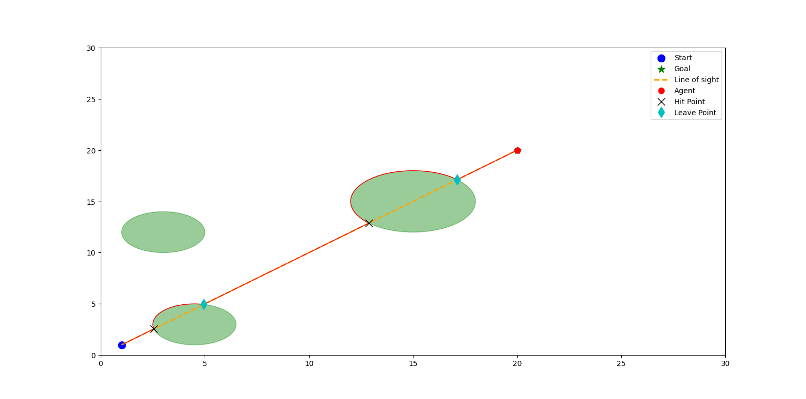
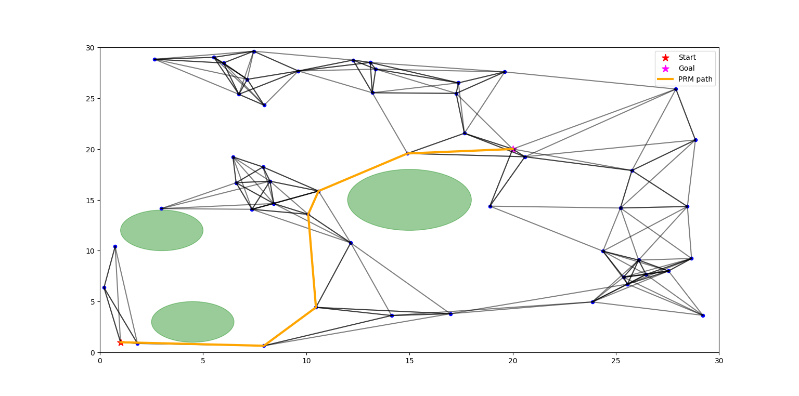
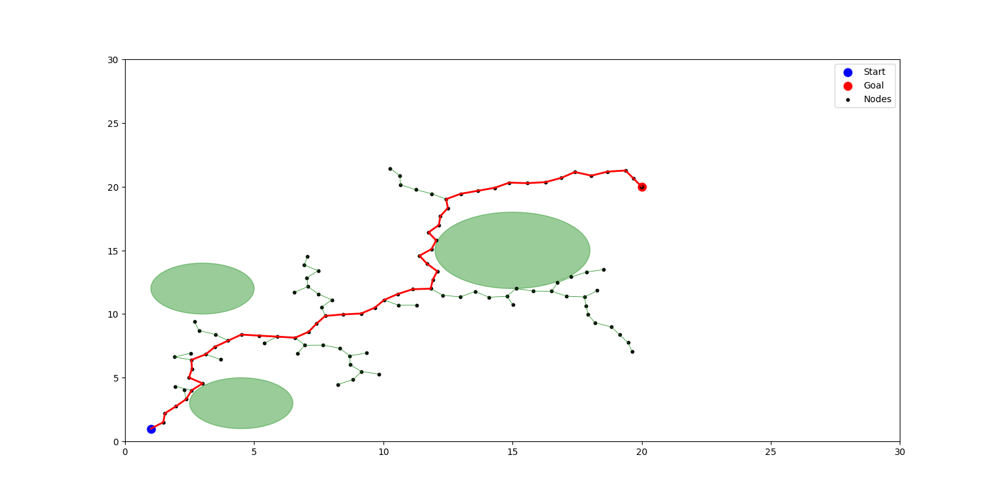

# Path Planning Algorithms - Implementation and Comparison

This repository contains implementations of three classical path planning algorithms: **BUG2**, **RRT (Rapidly-exploring Random Tree)**, and **PRM (Probabilistic Roadmap)**. Each algorithm finds a collision-free path from a start position to a goal position in a 2D environment with circular obstacles.

**GitHub Repository**: [Implementation-of-Planning-Algorithms](https://github.com/Hrishit-Gupta/Implementation-of-Planning-Algorithms.git)

---

## Environment Configuration

### Workspace
- **Dimensions**: 30 × 30 units
- **Start Position**: (1, 1) - Blue circle
- **Goal Position**: (20, 20) - Orange/Red circle

### Obstacles
The environment contains three elliptical/circular obstacles represented in green:

| Obstacle | Center Position | Radius |
|----------|----------------|--------|
| Obstacle 1 | (4.5, 3) | 2.0 |
| Obstacle 2 | (3, 12) | 2.0 |
| Obstacle 3 | (15, 15) | 3.0 |

---

## Algorithms Implemented

### 1. BUG2 Algorithm (`bug.py`)

**Description:**  
BUG2 is a simple, reactive path planning algorithm that follows a "move-to-goal" strategy. The robot moves directly toward the goal until it encounters an obstacle, then follows the obstacle boundary until it can resume moving toward the goal along the M-line (line of sight from start to goal).

**Key Features:**
- **Reactive approach**: Makes decisions based on local sensor information
- **Boundary following**: When blocked, the robot follows obstacle contours
- **M-line strategy**: Uses the line connecting start to goal as reference (shown as orange dashed line)
- **Guaranteed convergence**: Always finds a path if one exists (completeness)

**Working Principle:**
1. Move directly toward the goal along the M-line (line of sight)
2. If an obstacle is encountered, record the hit point (marked with X)
3. Follow the obstacle boundary until reaching a leave point (marked with cyan diamond)
4. Leave the boundary when a point closer to the goal on the M-line is found
5. Resume motion toward the goal
6. Repeat until the goal is reached

**Simulation Features:**
- **Real-time visualization**: Watch the agent (red diamond) navigate in real-time
- **Hit/Leave points**: Cyan diamonds show where the agent leaves obstacle boundaries
- **Orange path**: Shows the complete trajectory taken by the agent

**Simulation Output:**



**Plot Details:**
- **Blue circle**: Start position (1, 1)
- **Yellow star**: Goal position (20, 20)
- **Orange dashed line**: Line of sight (M-line) from start to goal
- **Green ellipses**: Three obstacles in the environment
- **Red diamond**: Agent's current position
- **X markers**: Hit points where agent encounters obstacles
- **Cyan diamonds**: Leave points where agent departs from obstacle boundaries
- **Orange solid line**: Complete path taken from start to goal

The agent successfully navigates around both obstacles by following their boundaries and strategically leaving when a better path is available.

---

### 2. PRM Algorithm (`prm.py`)

**Description:**  
PRM (Probabilistic Roadmap) is a multi-query path planning algorithm that constructs a roadmap of the free configuration space by randomly sampling collision-free points and connecting nearby points with collision-free edges. It then uses graph search to find optimal paths.

**Key Features:**
- **Two-phase approach**: Learning phase (roadmap construction) + Query phase (path search)
- **Multi-query efficiency**: Roadmap can be reused for multiple start-goal queries
- **Graph-based**: Uses A* algorithm to find optimal paths through the roadmap
- **Probabilistic completeness**: Coverage improves with more samples

**Working Principle:**
1. **Learning Phase**:
   - Randomly sample N points in the configuration space (30×30 workspace)
   - Keep only collision-free samples (blue dots)
   - Connect nearby samples with collision-free edges (gray lines) to form a graph
   - Build a comprehensive roadmap covering the free space
2. **Query Phase**:
   - Connect start (red star) and goal (red star) to the nearest roadmap nodes
   - Use A* search algorithm to find the shortest path through the roadmap
   - Extract the optimal path (orange line)

**Simulation Features:**
- **Animated roadmap construction**: Watch nodes being sampled and connected in real-time
- **Graph visualization**: See the complete roadmap network
- **A* pathfinding**: Optimal path highlighted after construction

**Simulation Output:**



**Plot Details:**
- **Red stars**: Start (1, 1) and Goal (20, 20) positions
- **Green ellipses**: Three obstacles in the environment
- **Blue dots**: Randomly sampled collision-free nodes forming the roadmap
- **Gray lines**: Edges connecting nearby nodes (roadmap connectivity)
- **Orange thick line**: Final optimal path found using A* search algorithm

The dense roadmap shows excellent coverage of the free configuration space. The algorithm successfully finds a smooth, near-optimal path that efficiently navigates around all obstacles. The path clearly demonstrates intelligent routing through the network of sampled points.

---

### 3. RRT Algorithm (`rrt.py`)

**Description:**  
RRT (Rapidly-exploring Random Tree) is a sampling-based path planning algorithm that incrementally builds a tree of collision-free paths by randomly sampling the configuration space and extending the tree toward new samples from the nearest existing nodes.

**Key Features:**
- **Probabilistic completeness**: Will find a path if one exists, given enough time
- **Efficient exploration**: Quickly explores large configuration spaces through random sampling
- **Tree-based growth**: Builds a tree structure from start toward goal
- **Incremental construction**: Adds one node at a time with collision checking

**Working Principle:**
1. Initialize tree with start position (blue circle)
2. Randomly sample a point in the 30×30 configuration space
3. Find the nearest node in the existing tree
4. Extend the tree toward the sample point with a fixed step size
5. If the new edge is collision-free, add the new node to the tree
6. Continue until the goal (orange circle) is reached or within threshold distance
7. Extract path by backtracking from goal to start through parent pointers

**Simulation Features:**
- **Real-time tree growth**: Watch the tree explore the space dynamically
- **Random exploration**: See how random sampling explores different regions
- **Final path extraction**: Path is highlighted after goal is reached

**Simulation Output:**



**Plot Details:**
- **Blue circle**: Start position (1, 1)
- **Orange circle**: Goal position (20, 20)
- **Green ellipses**: Three obstacles in the environment
- **Black dots**: Tree nodes sampled during exploration
- **Black lines**: Tree branches connecting parent-child nodes
- **Red thick line**: Final path extracted from start to goal

The visualization clearly shows the tree structure exploring the free space randomly. The black network demonstrates how RRT incrementally builds paths by extending toward random samples. The final red path shows a feasible solution connecting start to goal while avoiding all obstacles. Note the characteristic jagged appearance of RRT paths due to the random sampling nature of the algorithm.

---


## Running the Simulations

### Prerequisites
```bash
pip install numpy matplotlib
```

### Execute Individual Algorithms

**BUG2 Algorithm:**
```bash
python bug.py
```
- Watch the agent navigate in real-time
- See obstacle boundary following behavior
- Observe hit and leave point decisions

**PRM Algorithm:**
```bash
python prm.py
```
- Watch the roadmap being constructed with random sampling
- See nodes and edges being added to the graph
- Observe A* finding the optimal path through the roadmap

**RRT Algorithm:**
```bash
python rrt.py
```
- Watch the tree grow from start position
- See random exploration of the configuration space
- Observe path extraction when goal is reached

Each script provides:
1. **Animated visualization** showing the algorithm working step-by-step
2. **Final result plot** showing the complete path
3. **Automatic saving** of result images to the Results folder

---

## Algorithm Comparison

| Algorithm | Type | Path Quality | Computation | Completeness | Visualization | Best Use Case |
|-----------|------|--------------|-------------|--------------|---------------|---------------|
| **BUG2** | Reactive | Suboptimal | Fast | Complete | Path with hit/leave points | Simple environments, sensor-based robots |
| **PRM** | Sampling-based | Near-optimal | Slow (build), Fast (query) | Prob. Complete | Dense roadmap graph | Multi-query scenarios, static maps |
| **RRT** | Sampling-based | Suboptimal | Medium | Prob. Complete | Tree structure | Single-query, complex spaces |

---

## Key Observations from Results

### BUG2 Path Characteristics:
- Follows obstacle boundaries closely when blocked
- Makes strategic decisions at leave points to rejoin M-line
- Path length depends heavily on obstacle placement
- Simple but effective for reactive navigation
- Clear hit and leave points marked on trajectory

### PRM Path Characteristics:
- Creates comprehensive roadmap of free space
- Finds smooth, near-optimal paths using A* search
- Dense sampling ensures good coverage around obstacles
- Path smoothly navigates between waypoints
- Excellent for multiple queries in same environment

### RRT Path Characteristics:
- Tree structure explores space incrementally
- Path has characteristic jagged appearance
- Random sampling can lead to suboptimal solutions
- Fast to find initial feasible path
- Tree density shows exploration effort

---

## Algorithm Parameters

Each implementation includes tunable parameters:

### BUG2 Parameters:
- Step size for agent movement
- Sensor range for obstacle detection
- Boundary following direction

### PRM Parameters:
- Number of samples: 100 nodes
- Connection radius for edge creation
- k-nearest neighbors for connectivity

### RRT Parameters:
- Maximum iterations: 5000
- Step size for tree extension
- Goal threshold distance
- Sampling bias toward goal

Modify these in the respective Python files to experiment with different behaviors.

---


## Implementation Highlights

✅ **Complete working simulations** with real-time visualization  
✅ **Proper collision detection** for all obstacles  
✅ **Path extraction and visualization** for all algorithms  
✅ **Animated execution** showing algorithm progression  

✅ **Result images** saved automatically  

---

## Future Enhancements

- Implement path smoothing for RRT (RRT* variant)
- Add dynamic obstacle handling
- Implement bidirectional RRT for faster convergence
- Compare computation times quantitatively
- Add more complex obstacle configurations
- Extend to 3D environments
- Implement hybrid approaches combining multiple algorithms

---

